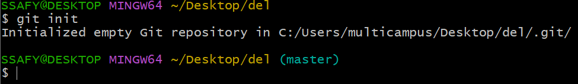

# Git

## Git?

**→   분산 버전 관리 프로그램**

중앙 집중식 버전 관리 vs 분산 버전 관리

중앙 집중식 버전 관리 : 한 개의 중앙 서버에서 모든 데이터를 관리

분산 버전 관리 : 사용자 로컬 서버, 중앙 서버 모두에 서 데이터를 관리

분산 버전 관리의 장점 : 데이터를 분산 저장하여 하나의 서버가 터져도 다른 서버에 데이터가 남아있음

Git기반의 저장소 서버를 제공하는 서비스

→ **GitLab**, **Github**, **Bitbucket**

싸피에서 GitLab을 사용하는 이유?

→ GitLab은 서버를 사용자에게 직접 제공해줘서 기술 유출에 대한 위험이 없다.

→ 삼성 어딘가에 GitLab 서버가 있다.

<aside>
💡 Git ≠ GitHub
→ 분산 버전 관리 프로그램 그자체 ≠ Git 기반의 저장소 서비스

</aside>

- Github를 사용하면 좋은점
    - 공개적인 버전관리를 통해 성실함, 능력 어필 가능
    - 대표적인 협업 툴로 주니어 개발자에게 요구되는 팀 개발 능력 어필

이외의 협업툴로..

→ Slack, jira 등등

**Repository**

- 특정 디렉토리를 버전 관리하는 **저장소**
    - **git init** 명령어로 로컬 저장소를 생성
    - **.git** 디렉토리에 **버전 관리에 필요한 모든 것**이 들어있음
    
    
    
    - (master) ← git으로 관리됨을 뜻함

### Git 기본기

- README.md 생성하기
    - 생성된 파일을 특정 버전으로 남긴다 ⇒ **커밋** 한다.
- 커밋은 3가지 영역을 바탕으로 동작
    - **Working Directory:** 내가 작업하고 있는 **실제 디렉토리**
    - **Staging Area:** **커밋**으로 남기고 싶은, **특정 버전**으로 관리하고 싶은 파일이 있는 곳
    - **Repository:** **커밋**들이 저장되는 곳(.git 폴더)

## CLI

**CLI ↔ GUI**

- **CLI(**Command Line interface)
    
    → 명령어를 통해 사용자와 컴퓨터가 상호 작용하는 방식
    
- **GUI(**Graphic User interface)
    
    → 그래픽을 통해 사용자와 컴퓨터가 상호 작용하는 방식
    

- CLI 장점
    - 컴퓨터의 리소스 절약(GUI에 비해)
    - 수 많은 서버 / 개발 시스템이 CLI를 통한 조작 환경을 제공
    

### **CLI의 기본적인 명령어**

- **touch**
    - 파일을 생성하는 명령어
- **mkdir**
    - 새 폴더를 생성하는 명령어
- **ls**
    - 현재 작업 중인 디렉토리의 폴더/파일 목록을 보여주는 명령어
- **cd**
    - 현재 작업 중인 디렉토리를 변경하는 명령어
    - cd .. → 부모 폴더로 이동(.. 은 부모 위치를 의미)
- **start/open**
    - 폴더/파일을 여는 명령어(Window → start, Mac → open)
    - start . ⇒ 현재 폴더 열어줌( . 은 현재 위치를 의미함)
- **rm**
    - 파일을 삭제하는 명령어
    - -r  옵션을 주면 폴더 삭제 가능
        - r 옵션은 recursion 으로 타고 타고 모두 삭제 하는 명령어


~ ←표시가 현재 작업중인 위치(자주 써서 ~표시)

실제 ~ 주소는 **C:\Users\multicampus**

~ 는 Home directory라고 함

### 절대경로 vs 상대경로

- **절대경로**
    - 루트 디렉토리부터 목적 지점까지 거치는 모든 경로를 전부 작성한 것
    - 윈도우 바탕 화면의 절대경로 -C:/Users/ssafy/Desktop
- **상대경로**
    - 현재 작업하고 있는 디렉토리를 기준으로 계산된 상대적 위치를 작성한 것
    - 현재 작업하고 있는 디레토리가 C:/Users일 때
    윈도우 바탕 화면으로의 상대 경로는 ssafy/Desktop
    - ./ : 현재 작업하고 있는 폴더
    - ../ : 현재 작업하고 있는 폴더의 부모 폴더
    

## Markdown

- 텍스트 기반의 가벼운 **마크업(markup)** 언어
    - 마크업(markup) : 태그(tag)를 이용하여 문서의 구조를 나타내는 것
    - 태그(tag) : #, *, - 등으로 문서의 구조를 나타낼 때 사용
- **문서의 구조**와 **내용**을 같이 쉽고 빠르게 적고자 탄생(마우스 사용 없이)

- **Github** 문서의 시작과 끝!
    - **README.md** 파일을 통해 오픈 소스의 **공식 문서** 작성
    - 개인 프로젝트의 **소개 문서** 작성
    - 매일 학습한 **내용 정리**
    - 마크다운을 이용한 블로그 운영

- **개발 문서**의 시작과 끝!
    - 대부분의 웹 에디터에서 지원(각종 블로그 사이트 등)
    - Jupyter Notebook, Notion, Typora다양한 메모장 프로그램 등

- **Typora**
    - **실시간 마크다운 변환**(미리보기) 제공
    - **이미지** 또는 **표** 삽입시 매우 편한 UI 제공
    - VS Conde등의 프로그램도 마크다운을 지원하지만 전용 프로그램을 사용하면 더 편하게 사용가능
    - 

### **Markdown의 태그들**

- **#(헤딩)**: 문서의 제목이나 소제목으로 사용
              갯수에 따라 크기가 다름
- **1.2.3.(리스트):** 순서가 있는 리스트
- ***, -(리스트):** 순서가 없는 리스트
- **``` ```(코드블럭**): 일반 텍스트를 코드로 변환해줌
- **` `(인라인 코드블럭)**:  문장 안에 코드가 들어 갈 때
- **[string](url):** 다른 페이지로 이동하는 링크를 삽입,
                     string 부분에 보이는 글자 작성, url부분에 링크 작성
- **:** 링크와 비슷하지만 **이미지를 삽입**합니다.
    - assets 폴더를 만들어 이미지를 저장함(md파일 이동 시 assets 함께 이동)
- ****Bold**, *italic*, ~~strikeout~~**
: 텍스트 강조 순서대로 굵게, 기울임, 취소선을 이용해 텍스트를 강조
- - - - : 수평선 가로로 긴 수평선을 작성(3개 이상이면 같은 동작)

**추가적인 태그활용법 공식 docs 참조([https://www.markdownguide.org/cheat-sheet/](https://www.markdownguide.org/cheat-sheet/))**